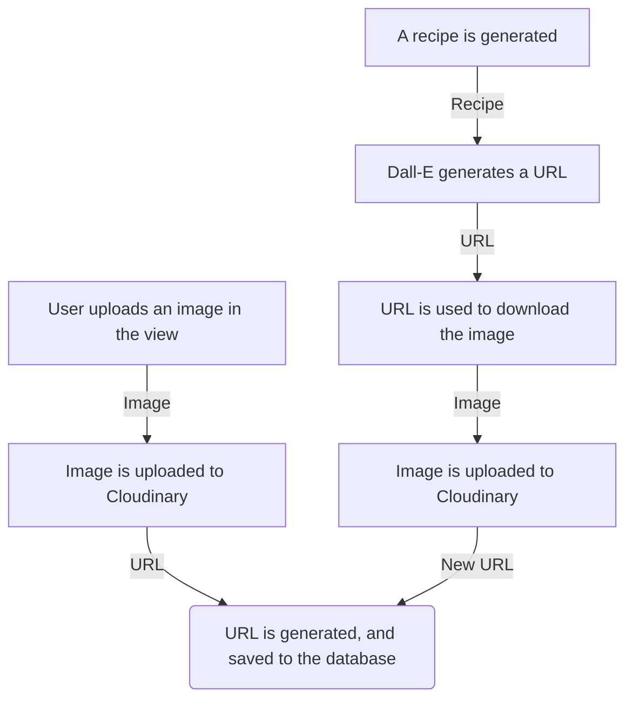

## MealMaven
### Overview & Abstract 
MealMaven is a meal planning application that generates recipes and images with the power of AI, with nutritional data and requirements estimated based upon a user’s dietary needs and preferences. This application is hosted in a cloud computing platform known as Azure, which means you can access and use this application from anywhere. The project’s objective is to provide users with a means to easily generate ideas for meals that fit within their tastes and needs and demonstrate technical skill. 

## Functional Overview - What Can MealMaven Do? 
Here's a rundown of everything MealMaven can do. In a recipe management application that includes and utilizes nutritional data, content should be easily generated and edited without the necessitation of a multitude of menus. MealMaven aims to excel where other applications fail in their user interface by ensuring users can begin generating recipes in as few as possible clicks unless they specify that they would like greater control over the content generated. Users will sign up and disclose their sex, current weight and height, and nutritional goal, and the information will be utilized to generate the recommended macronutrients for that user so they can proceed to adding recipes that align with their goals to their meal plans immediately. 


| Summary of Features       | Description                                                                       |
|---------------|-------------------------------------------|
| Recipe Management     | Generate recipes and their images and edit, read, and reset recipe slots.                 |
| Day Management     | Generate meals for entire days, view recipes within days, and reset days.                  |
| Week Management    | Create, delete, and edit individual weeks.                |
| Image Management    | Upload and delete images from recipes.                  |
| Authentication    | Use the Microsoft Authenticator app for two-factor authentication.                 |
| Login, Registration, & Verification     | Login, Sign Out, Register, and Verify Users With Valid Emails.                      |


## Technical Design Decisions
| Category    | Technology/Tool      | Name/Version | Justification                                                                                                   |
|-------------|-----------------------|--------------|-----------------------------------------------------------------------------------------------------------------|
| Language    | C#, JavaScript, HTML, CSS, SQL | 8.0, ES6, 5, 4.15, 16.0 | Core languages and markup for application development and interactivity.                                       |
| Framework           | ASP.NET Core | 8.0   | Core framework for cross-platform development |
| Styling Frameworks & Libraries | Bootstrap, Chart.js | 4.1, -| CSS framework for styling, and JavaScript library for charts. |
| Object-Relational Mapper | Entity Framework Core      | 6.0          | Facilitates object-oriented data handling, reducing reliance on raw SQL queries.                       |
| IDE         | Microsoft Visual Studio | Platform 2022 | Primary integrated development environment for comprehensive .NET development.                                   |
| Cloud Computing Platform       | Microsoft Azure       | -            | Hosting, deployment, and scaling for MySQL database and web application, secure key storage.                   |
| Data Storage| MySQL                 | -            | Primary relational database for storing application data.                                                        |
| APIs | OpenAI API, Nutrition Ninja, Cloudinary, Sendgrid | GPT-3 & Dall-E,- ,- , -| For content generation, acquiring nutritional data from ingredients, storing and retrieving images, and sending emails to users |


## Running and Accessing the ASP.NET Core Project

To run and access the ASP.NET Core project locally, follow the steps outlined below: 

### Prerequisites

1. **Install .NET Core SDK**: Ensure that you have [.NET Core SDK 8.0](https://dotnet.microsoft.com/download) installed on your machine. You can verify the installation by running `dotnet --version` in your terminal or command prompt. It is advised that you use Visual Studio 2022 when working with MealMaven and other ASP.NET Core applications. 

2. **Clone the Repository**: Clone the project repository from GitHub to your local machine using the following command. Bear in mind that MealMaven will be changing its repository name from RecipeHelperApp to MealMaven. You may follow this repository to see this change. For now, to clone the repository, use the current repository name:
   ```bash
   git clone https://github.com/Klovach/RecipeHelperApp.git

### Accessing the Application

Once the application is running, you can access it using a web browser:

- **Local Access**: Open your web browser and navigate to [http://localhost:4437](http://localhost:4437) or click IIS Express within Visual Studio 2022 to view the application.
- **Access Online**: You may visit the application online in Azure by going to the application URL in Azure App Service. 

## Logical Design
This application uses a Code First approach. A code first approach means that models and their relationships are coded first, and that tables are generated based upon those models. 

Architectural design patterns and techniques utilized in this application include MVC (Model-View-Controller) and Dependency Injection. This application uses a no-repository design pattern, meaning there is no abstraction between the controller and the database context. However, a repository pattern or unit of work pattern is intended to be implemented int he future to more easily facilitate automated unit testing or test-driven development (TDD).

Apart from ensuring a sustainable and modular architecture, the logical solution design has the following objectives: to route the user to necessary views, update presentations as required, perform calculations on data behind the scenes, and retrieve and update data from a database to fulfill the basic requirements of the application. 

As a meal planning application with generative capabilities, because users must be able to navigate their planner, generate new recipes according to their nutritional needs, and be able to have their needs calculated for them based upon their data. To achieve these objectives, it is essential to store and create models that can represent the various components in the application. These models server as both blueprints for what should be displayed to the view and what fields should be manipulated in the database.  

This application also utilizes Entity Framework as an ORM (Object Relational Mapper) to simplify queries to the database. ORM is a programming technique that eases the process of mapping data between a relational database and objects within a program. In the current solution, the application's controllers focus upon how data is stored and accessed while using services to perform calculations as neccessary. 

## Physical Design 
The goal of the solution is to ensure the application is both accessible to its user and minimize storage costs and server management concerns. MealMaven is software as a service (SaaS), the cloud provider, Microsoft Azure, gives a user access to the application running in the cloud. The application is hosted in a public cloud, which means the development team does not  have to build and maintain the infrastructure. Instead, the application is hosted on a single server which is managed in another location in the central US rather than hosted locally. Additionally, through Microsoft Azure, another server responsible for hosting the SQL Database is managed in another location in the central US. To access the application, a user can initiate a request to access the application by entering a URL into a web browser or clicking on a hyperlink. The user's request triggers a Domain Name System (DNS) resolution. The domain name in the URL is translated into an IP address by a DNS server. This IP address is used to locate the web server hosting the website or application. From there, the  web browser sends an HTTP or HTTPS request to the web server identified by the IP address. By hosting the application online, the application can be accessed anywhere with any device with an internet browser and internet connection. 

### Cloud Architecture
This application is hosted in Azure using Azure App Service to ensure the application can be accessed from anywhere. Below is a simplistic diagram of the application's cloud computing arhcitecture. 


### Continuous Integration & Continuous Deployment Pipeline
This project utilizes Azure DevOps Pipelines, a service designed to automate building, testing, and deploying code whenever changes are made to the repository. The source code for this application resides within the project's GitHub repository. Azure App Service serves as the deployment destination for the application. The configured pipeline actively monitors the source repository for any updates. Upon detecting a new commit or push to the repository, the application undergoes automatic rebuilding and redeployment on Azure and minimizes the need for manual intervention in the deployment process. To initiate the deployment of the application, you may navigate to the Azure DevOPs portal from Azure App Service to setup a pipeline in Azure Pipelines. Connect the Azure DevOps project to the GitHub repository where this application resides. Ensure the CI pipeline commits to the desired branch (master) and that the CD pipeline deploys to the application in Azure App Service after a successful build. You may monitor the CI/CD pipeline execution in Azure DevOps or GitHub Actions to ensure the deployment succeeded. 

### Image & Media Storage
This project leverages a cloud-based service known as Cloudinary, which is not connected to Azure. Using Cloudinary API, we may store images in Cloudinary and retrieve the images by the public id(which is preset in every Cloudinary URL). In addition to the storage of images, Cloudinary is also capable of cropping and resizing images, minimizing the space each image takes in storage. Below is a flowchart which demonstrates this process.


## Monitoring & Logging
Monitoring and logging is achieved by implementing an interface called ILogger. If desired, it is possible to set up alerts and notifications to be informed about pipeline failures or other issues. To monitor the uptime of the application, UpTime robot, a free uptime monitoring service is utilized for this application. Azure Monitor can be activated at an additional price and logs can be views as is in Azure's 'Logs' under Azure App Service as the application is running.  
